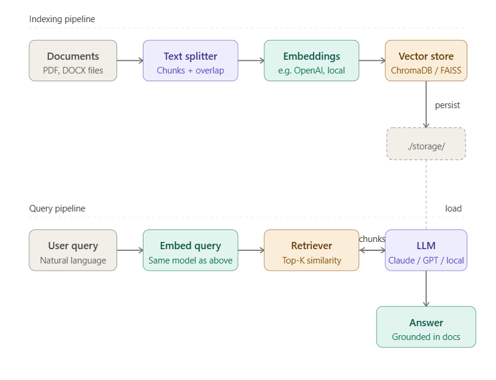

# RAG Document Chat

Chat with your PDF and DOCX files using a fully local stack — no API keys required.

**Stack:** LlamaIndex · ChromaDB · Ollama (llama3.2 + nomic-embed-text)



---

## Prerequisites

- Python 3.10+
- [Ollama](https://ollama.com) installed and running


### 0. Download and install Ollama

1. Go to [https://ollama.com/download](https://ollama.com/download)
2. Click **Download for Windows**
3. Run the downloaded installer (`OllamaSetup.exe`)
4. Follow the on-screen prompts — no special options needed

> Ollama installs silently and registers itself as a background service. After installation, you'll see the 🦙 Ollama icon in your system tray.

### 1. Start Ollama and pull the required models

After installing Ollama, it runs automatically as a background service. If it's not running, start it manually:

```bash
ollama serve
```

Then pull the required models (one-time setup):

```bash
ollama pull llama3.2
ollama pull nomic-embed-text
```

### 2. Clone the repo and install dependencies

```bash
git clone https://github.com/DeepthyU/RAG.git
cd RAG
pip install -r requirements.txt
```

### 3. Configure environment

```bash
cp .env.example .env
```

The defaults work out of the box. Edit `.env` only if you need to change models or Ollama's URL.

### 4. Add your documents

Drop `.pdf` or `.docx` files into the `docs/` folder:

```
docs/
  my_report.pdf
  contract.docx
  research_paper.pdf
```

### 5. Run

```bash
python main.py
```

On **first run** the app will:
1. Load and chunk all documents in `docs/`
2. Generate embeddings using `nomic-embed-text` via Ollama
3. Persist the vector index to `storage/` (ChromaDB on disk)
4. Launch an interactive chat loop

On **subsequent runs** it loads the persisted index directly — no re-embedding needed.

---

## Chat commands

| Input | Effect |
|-------|--------|
| Any question | Query your documents |
| `sources` | Toggle display of source chunks and relevance scores |
| `exit` / `quit` | Exit the app |

---

## Re-indexing

When you add new documents:

```bash
# Re-index everything
python ingest.py

# Wipe the existing index and rebuild from scratch
python ingest.py --reset
```

---

## Configuration (`.env`)

| Variable | Default | Description |
|----------|---------|-------------|
| `OLLAMA_BASE_URL` | `http://localhost:11434` | Ollama server URL |
| `LLM_MODEL` | `llama3.2` | LLM used for answering questions |
| `EMBED_MODEL` | `nomic-embed-text` | Embedding model |
| `CHUNK_SIZE` | `512` | Tokens per chunk |
| `CHUNK_OVERLAP` | `64` | Overlap between chunks |
| `TOP_K` | `5` | Number of retrieved chunks per query |

---

## Project structure

```
RAG/
├── docs/            <- Put your PDFs and DOCX files here
├── storage/         <- ChromaDB vector index (auto-created, gitignored)
├── main.py          <- Chat application entry point
├── ingest.py        <- Standalone re-indexing script
├── requirements.txt
├── .env.example
└── README.md
```

---

## Swapping the LLM

To use a different Ollama model, update `.env`:

```env
LLM_MODEL=mistral
EMBED_MODEL=nomic-embed-text
```

Then pull the model first:

```bash
ollama pull mistral
```
